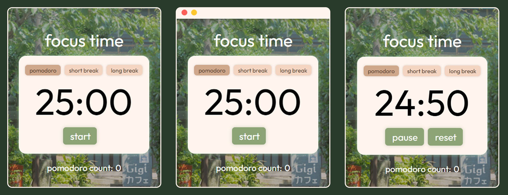

# Pomodoro
A minimal, macOS-inspired Pomodoro timer built as a desktop app with Electron.



## Overview

This is a frameless, desktop Pomodoro timer with a custom title bar, three session modes (pomodoro / short break / long break), and automatic cycling through the standard 25-5-15 Pomodoro Technique — with a long break every 4th work session. The total pomodoro count persists across restarts, and the app includes a subtle animated bubble cursor trail.

## Features

- **25 / 5 / 15 minute cycle** — standard work, short break, and long break durations
- **Automatic session progression** — after 4 completed pomodoros, the next break is automatically a long break instead of a short one
- **Persistent total pomodoro count** — total completed work sessions are tracked separately from the current session counter and survive app restarts via `electron-store`
- **Bubble cursor trail** — a subtle animated cursor effect follows mouse movement inside the app for a more engaging desktop experience
- **Custom frameless window** — no native OS title bar; a custom-drawn title bar with macOS-style traffic light controls (close / minimize)
- **Auto-hiding title bar** — the title bar fades out when the cursor leaves the app window and reappears when it returns, tracked at the OS level so it works reliably regardless of what's happening in the page
- **Whole-window dragging** — the entire app (not just the title bar) can be used to reposition the window
- **Manual mode switching** — jump directly to pomodoro, short break, or long break at any time
- **Start / pause / reset controls** — full control over the active countdown

## Tech Stack

- **Electron** — desktop app shell and windowing
- **HTML / CSS / JavaScript** — UI and timer logic (no frontend framework)
- **electron-store** — lightweight persisted storage for the pomodoro count
- **electron-builder** — packages the app into a distributable Windows installer

## Project Structure

```
pomodoro/
├── assets/
|   ├── appDemo.png       # app demo image  
│   ├── bgImg.jpg         # background image
│   ├── cross.png         # close icon
│   └── minimize.png      # minimize icon
├── build/
│   └── icon.ico          # app icon used by electron-builder
├── bubbleCursor.js       # animated cursor effect in the renderer
├── index.html            # app markup
├── main.js               # Electron main process (window creation, IPC, cursor tracking, persisted store)
├── preload.js            # contextBridge — exposes safe window controls & store access to the renderer
├── script.js             # timer logic and UI event handling
├── styles.css            # app styling
├── package.json
└── package-lock.json
```

## Architecture Notes

The app uses Electron's recommended security model rather than disabling context isolation. `main.js` runs with full Node/Electron access; `preload.js` runs in an isolated bridge context and exposes a narrow, purpose-built API to the renderer via `contextBridge`. `script.js` (the renderer) never touches Node or Electron APIs directly.
 
**Window controls** — `window.windowControls.close()` / `.minimize()` are relayed to the main process over IPC (`ipcRenderer.send` → `ipcMain.on`), which calls the real `win.close()` / `win.minimize()`.
 
**Persistent total pomodoro count** — `window.pomodoroStore.getCount()` / `.setCount()` read and write a value held in an `electron-store` instance living in the main process. `getCount()` uses `ipcRenderer.invoke` / `ipcMain.handle` (request/response) rather than fire-and-forget `send`, since the renderer needs the saved value back on startup. The count is written to a small JSON file in Electron's per-OS user data directory, so it survives closing and reopening the app.
 
**Auto-hiding title bar** — rather than relying on DOM `mouseenter` / `mouseleave` events (which are unreliable over `-webkit-app-region: drag` elements, since drag regions hand mouse hit-testing off to the OS), cursor position is tracked directly in the main process using Electron's `screen.getCursorScreenPoint()`, polled on an interval and compared against the window's bounds via `win.getBounds()`. The main process only notifies the renderer (`cursor-enter` / `cursor-leave`) when the inside/outside state actually changes, keeping this cheap and independent of anything happening inside the page.

## Getting Started

### Prerequisites

- [Node.js](https://nodejs.org/) (includes npm)

### Installation

```bash
git clone https://github.com/vnavirr/pomodoro.git
cd pomodoro
npm install
```

If npm reports pending install scripts (from `electron` or `electron-winstaller`), approve them so Electron's binary downloads correctly:

```bash
npm approve-scripts --allow-scripts-pending
```

> **Note:** this project pins `electron-store@8.x`, since versions 9+ are ESM-only and incompatible with this project's CommonJS setup.


### Run in development

```bash
npm run start
```

This launches the app via `electron .`, using your local Node/Electron install — no build step required for day-to-day development.

## Building a Distributable

This project uses [electron-builder](https://www.electron.build/) to package the app into a standalone Windows installer.

```bash
npm run dist
```

This produces a `dist/` folder containing an NSIS installer (e.g. `Pomodoro Setup 1.0.0.exe`). Running that installer creates a normal Windows application — Start Menu entry, desktop shortcut, and uninstaller included — independent of Node, npm, or this repository.

> **Note:** the built installer is currently unsigned, so Windows SmartScreen may show a warning on first run. This is expected for a locally-built, non-code-signed app and does not indicate a problem with the build.

## Usage

- **Start** — begins the countdown for the current mode
- **Pause** — stops the countdown without resetting it
- **Reset** — resets the countdown back to the full duration of the current mode
- **pomodoro / short break / long break** — switch modes manually at any time; switching modes stops any active countdown
- **Current session and total pomodoro counters** — see the number of pomodoros completed in the current run and the lifetime total across app restarts
- **Hover near the top of the window** — reveals the title bar and its close/minimize controls; move away and it fades out

## Roadmap / Possible Improvements

- [ ] Desktop notifications instead of `alert()` on session end
- [ ] Configurable session durations
- [ ] Customizable cursor

## License
 
MIT
